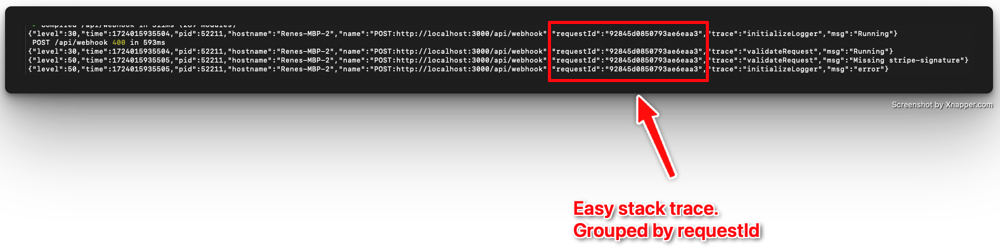
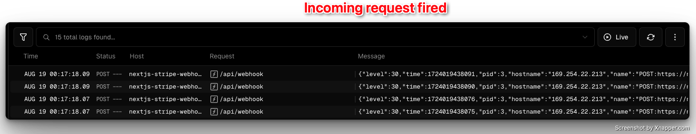
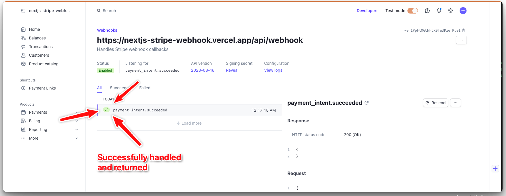

# NextJS Stripe Webhook

<p>
    <a href="https://github.com/renenielsendk/nextjs-stripe-webhook/stargazers"></a>
    <a href="https://github.com/renenielsendk/nextjs-stripe-webhook/issues"></a>
    <a href="https://github.com/renenielsendk/nextjs-stripe-webhook/blob/main/LICENSE.md"></a>
</p>

The NextJS Stripe Webhook project sets up the core structure for handling Stripe webhook events in a Next.js app. It handles all the boilerplate around processing webhooks, letting you focus on implementing your custom logic.

You get a clean, ready-to-use setup—just drop in your business logic and start managing Stripe events effortlessly.

- [Introduction](#introduction)
- [Built with](#built-with)
- [Features](#features)
  - [Streamlined Logging](#streamlined-logging)
  - [Uniform Error Handling](#uniform-error-handling)
  - [Code Prettier](#code-prettier)
  - [Code Validation](#code-validation)
- [Example Implementations](#example-implementations)
- [Getting Started](#getting-started)
  - [Local Development](#step-1-local-development)
  - [Deploy Your Application](#step-2-deploy-your-application)
  - [Configure Stripe Webhook](#step-3-configure-stripe-webhook)
- [License](#license)
- [Links](#links)

## Built with

- [Next.js](https://nextjs.org/)
- [Stripe](https://stripe.com/)
- [TypeScript](https://www.typescriptlang.org/)
- [Node.js](https://nodejs.org/)

## Features

### Streamlined Logging

This project utilizes [Pino logger](https://github.com/pinojs/pino) for streamlined logging, enabling you to easily trace logs throughout the application.



### Uniform Error Handling

You can throw errors anywhere in your implementation using the [APIError](https://github.com/renenielsendk/nextjs-stripe-webhook/blob/3f5c97cee5b270d28445dc06940be0744957ee6f/src/_shared/types/api.ts#L6).

These errors are consistently caught and returned as HTTP responses.

Example:

```
const user = await db.user.find({ id: '1' });

if (!user) {
  throw new ApiError({
    type: 'NotFoundError',
    message: 'User not found', // optional
  });
}
```

The above example will return Http Status `404` with body `{ message: 'User not found'}`.

### Code Prettier

Running `yarn prettier` will format your code to a consistent style, ensuring a uniform codebase.

### Code Validation

Running `yarn validate` will validate the entire codebase, helping to maintain code quality and consistency.


## Example Implementations

This project includes example implementations for handling specific Stripe webhook events. These examples show how to manage the following events within your application:

### API Route

- **Method**: POST
- **Path**: `/api/webhook`
- **Description**: Handles incoming Stripe webhook events.

### Supported Webhook Events

- **`payment_intent.succeeded`**: Handles successful payment intents.
- **`account.updated`**: Handles updates to Stripe accounts.

These events are implemented with example handlers, demonstrating how to process them effectively in your application.

## Getting Started

### Step 1: Local Development

To start working with this project locally, follow these steps:

1. **Fork this repository**: Create your own fork of this repository on GitHub.
2. **Clone the repository**: Clone your forked repository to your local machine.
3. **Navigate to the project directory**: Move into the directory where the project was cloned.
4. **Install dependencies**: Run `yarn install` to install all required dependencies.
5. **Set up environment variables**: Copy `.env.example` to `.env.local` and update the environment variables with your Stripe secret keys and other necessary configurations.
6. **Start the development server**: Run `yarn dev` to start the development server.

### Step 2: Deploy Your Application

Once your business logic is implemented and tested locally, deploy your application using your preferred hosting service (e.g., Vercel, Netlify, Heroku).

### Step 3: Configure Stripe Webhook

After deploying your application, configure the Stripe webhook to point to your deployed endpoint. Follow [this guide](./docs/stripe-dashboard-add-webhook/README.md) to set up the webhook in your Stripe dashboard.

### Step 4: Celebrate



👇👇👇



👇👇👇


## License

Licensed under [MIT](./LICENSE.md).

## Links

Looking for more exciting projects and insights?

👇👇

Connect with me on [𝕏 @renenielsendk](https://x.com/renenielsendk) for updates, tips, and more awesome content!

#nextjs, #stripe, #stripe-checkout, #subscription, #api, #template, #webhook
