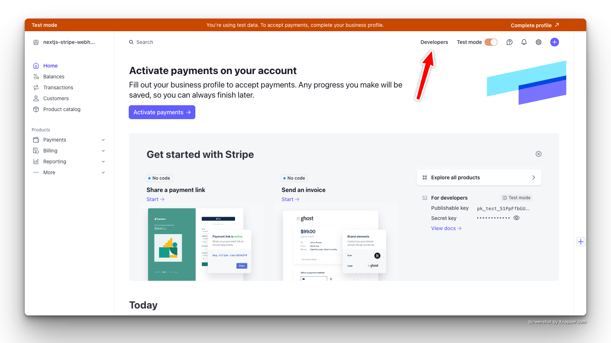
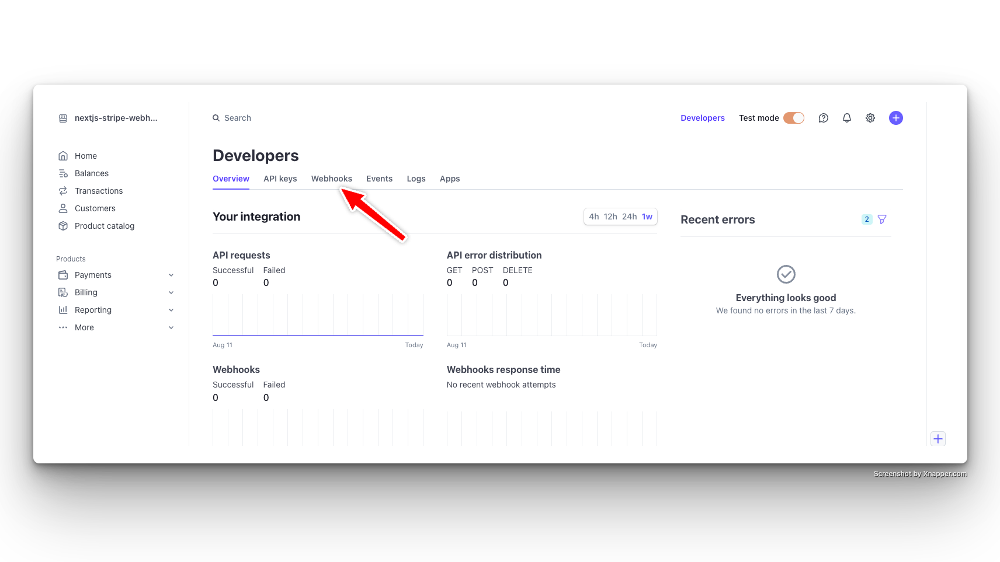
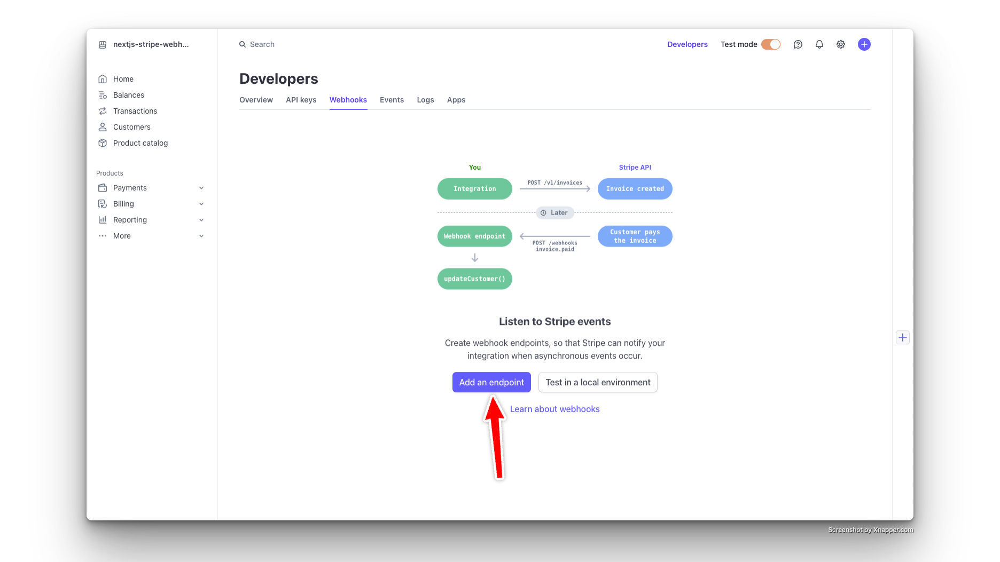
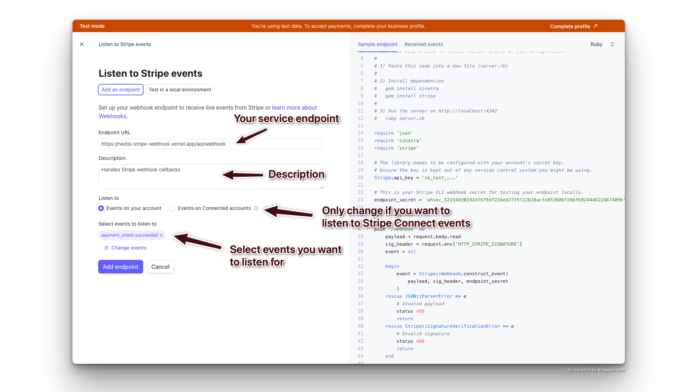
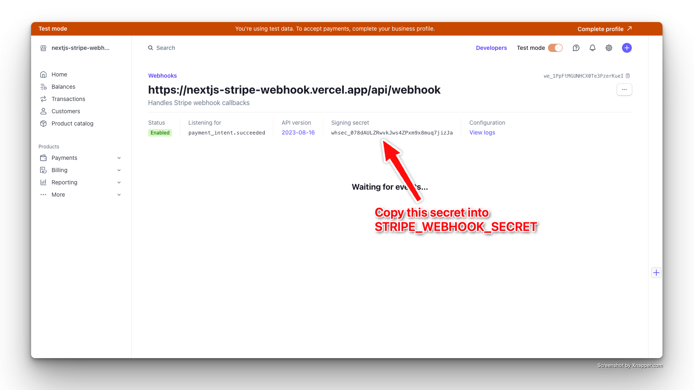
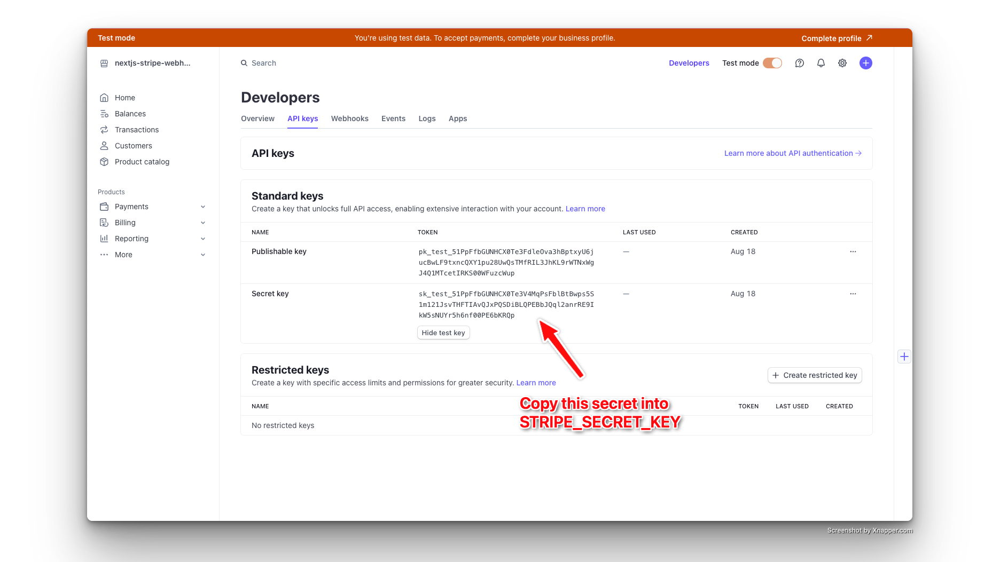

# Stripe Dashboard: Adding a Webhook

This guide will explain how to add a webhook to your Stripe application, enabling your service to receive and respond to Stripe events like payment confirmations or account updates.

- [Setting up the webhook](#setting-up-the-webhook)
- [Copying your Stripe secret](#copying-your-stripe-secret)
- [Final steps](#final-steps)

## Setting up the webhook

1. **Access the Stripe Dashboard**:
   - First, go to your [Stripe Dashboard](https://dashboard.stripe.com).
   - Click the `Developers` button (🔧) in the top left corner.
   

2. **Navigate to Webhooks**:
   - Click the `Webhooks` tab in the Developers section.
   

3. **Add a New Webhook Endpoint**:
   - Click the `Add an endpoint` button.
   

4. **Configure the Webhook Endpoint**:
   - Fill out the webhook details as follows:
     - **Endpoint URL**: Enter the URL of your service where Stripe will send event notifications.
     - **Description**: Provide a brief description of the webhook's purpose (e.g., "Production Payments Webhook").
     - **Listen to**: Leave this section as is unless you need to listen for [Stripe Connect](https://stripe.com/en-dk/connect) events.
     - **Select events to listen to**: Choose the events you want to be notified about. You can select all events, but this guide includes example implementations for `payment_intent.succeeded` and `account.updated`.
   - Click `Add endpoint` to save the configuration.
   

5. **Copy the Webhook Secret**:
   - After adding the endpoint, Stripe will generate a unique secret key. Copy this secret key, as you will need to add it to your environment variables as `STRIPE_WEBHOOK_SECRET`.
   - **Security Note**: Keep this secret safe and secure. It is used to verify that incoming webhook requests are genuinely from Stripe.
   

## Copying your Stripe secret

1. **Access the Stripe Dashboard**:
   - First, go to your [Stripe Dashboard](https://dashboard.stripe.com).
   - Click the `Developers` button (🔧) in the top left corner.
   

2. **Navigate to API Keys**:
   - Click the `API keys` tab in the Developers section.
   

3. **Copy the key to application variables**:
   - Copy the key and insert into your application variable `STRIPE_SECRET_KEY`
   

## Final Steps

- **Test Your Webhook**: After setting up the webhook, you should test it using the Stripe CLI or by triggering events from the Stripe Dashboard to ensure it's functioning correctly.
